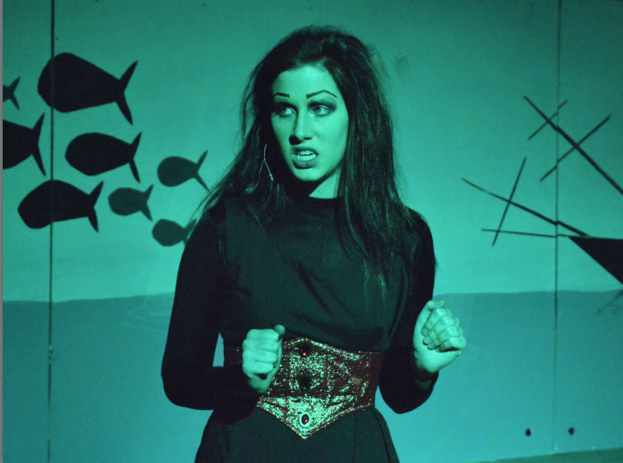

I have been able to be a part of some pretty incredible things in my life. Here they are:

###The Wolves
In Fall 2018, I was able to play the role of #25 in The Wolves. She was the incredible captain of the high school girl's soccer team.

Photos by Lynn Willis, Courtesy of the Appalachian State University Department of Theatre and Dance

**I was also part of the dramaturgy team. Here is the research that I did for [#13](https://docs.google.com/document/d/19UgWXsvDI6ktYSjsXA267j7iMUQ_k5Nqks4kOAKPWws/edit?usp=sharing), [location](https://docs.google.com/document/d/1AOiTXYKdYrQU-p0gtSDHfZmg0c1UhWvY6fvFC8d4Nbc/edit?usp=sharing), and [defensive skills](https://docs.google.com/document/d/1aDAAEnuZV_59mZuGgHqYaMnY0rgje3KW-O1b7L5sxMc/edit?usp=sharing).**

***
###First Year Showcase
In Fall 2017, I was able to a part of a show written and performed within a month by the ensemble.

***
###The Little Mermaid
In Fall 2015, I played Ursula in my high school's production of The Little Mermaid

